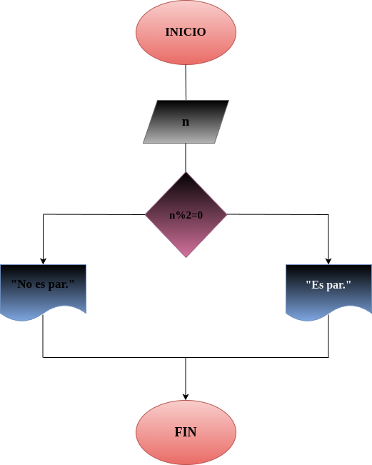

# Par_Impar
Programa para determinar si un número entero es par o impar

## Input
Ingresar el número del que desea saber si es par o impar
 
 ## Output
 Indicar si el número ingresado es par o impar

 ## Diseño
 
 